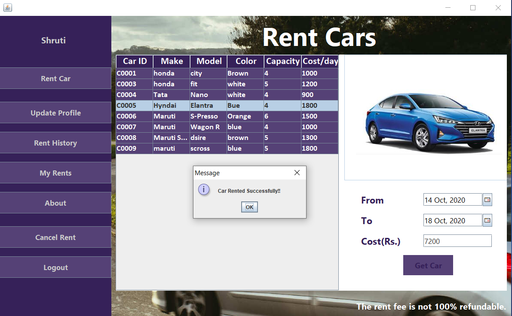

# Car-Rental-Portal
A Java-based user-friendly GUI application for renting a variety of cars online based on customer’s needs with features like user-alerts for defaulters and identity details for security. It also provides an interface for the admin to manage cars and customers.

